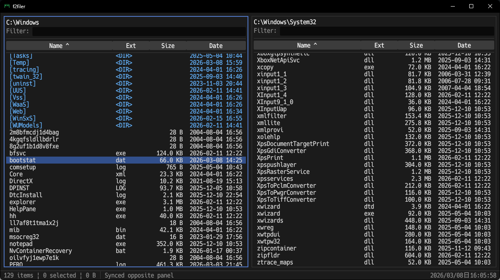
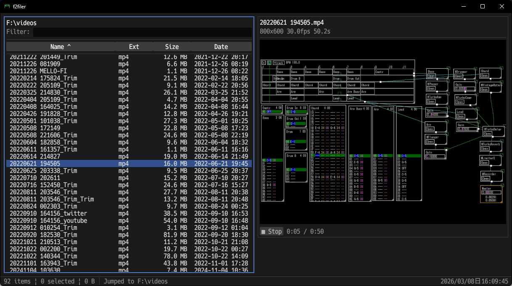

# f2filer

Windows 用の2画面ファイラー。

## スクリーンショット




## 特徴

- **2画面構成** — 左右パネルでファイル操作（コピー/移動）が直感的
- **Vim 風キーバインド** — `j`/`k` でカーソル、`h`/`l` でディレクトリ移動
- **画像プレビュー** — PNG/JPEG/GIF/BMP/WebP/SVG に対応、GIF アニメーション再生
- **動画プレビュー** — MP4/AVI/MKV 等を ffmpeg でデコード、音声付きリアルタイム再生
- **音声プレビュー** — WAV/OGG/AIFF の波形をリアルタイム描画、無音スキップ付き自動再生
- **ZIP プレビュー** — 圧縮ファイルの内容一覧を展開なしで表示
- **登録ディレクトリ** — よく使うディレクトリをブックマーク、カスタムショートカットキーで即ジャンプ
- **フィルター** — インクリメンタル検索で目的のファイルに素早くアクセス
- **再帰検索** — `Alt+f` でサブディレクトリも含めたファイル検索、相対パス表示
- **ドライブ切替** — ドライブレターキーで直接選択、前回のディレクトリを復元
- **WSL 統合** — WSL ディストリビューションをドライブ一覧に統合
- **設定の自動保存** — ウィンドウ位置・サイズ、パネルのディレクトリ、カーソル位置を自動復元

## 必要環境

### 実行時
- 動画プレビューには [ffmpeg](https://ffmpeg.org/)（ffmpeg / ffprobe）が PATH に必要（`winget install ffmpeg` でインストール可能）
- 日本語表示には CJK 対応フォントの設定を推奨（`Ctrl+,` で設定画面からシステムフォントを選択可能）

### 開発時
- Rust 1.81+

## ビルド・実行

```bash
cargo build
cargo run
```

## キーバインド

Vim 風のキーバインドを採用。アプリ内で `?` キーを押すとショートカット一覧を表示できます。

## 設定

設定ファイル: `%APPDATA%\f2filer\config.json`

| 項目 | 説明 |
|------|------|
| `show_hidden` | 隠しファイル表示 |
| `last_left_dir` / `last_right_dir` | パネルの最後のディレクトリ |
| `drive_dirs` | ドライブごとの最後のディレクトリ |
| `registered_dirs` | 登録ディレクトリ（キー、名前、パス） |
| `window_x` / `window_y` / `window_width` / `window_height` | ウィンドウ位置・サイズ |
| `font_path` | フォントファイルのパス（未指定時は egui デフォルト） |
| `font_size` | フォントサイズ（未指定時は 16pt） |

`Ctrl+,` で設定画面を開き、システムフォント一覧から選択できます。`+`/`-` キーでフォントサイズを変更できます。設定はディレクトリ移動のたびに自動保存されます。

## 技術スタック

- **言語**: Rust (edition 2021)
- **GUI**: [eframe](https://github.com/emilk/egui/tree/master/crates/eframe) 0.31 / [egui](https://github.com/emilk/egui)
- **画像**: [image](https://crates.io/crates/image) 0.25
- **SVG**: [resvg](https://crates.io/crates/resvg) 0.44
- **動画/音声デコード**: ffmpeg / ffprobe（外部コマンド）
- **音声再生**: [rodio](https://crates.io/crates/rodio) 0.20 (WAV/OGG/AIFF)
- **WAV 解析**: [hound](https://crates.io/crates/hound) 3
- **ZIP**: [zip](https://crates.io/crates/zip) 2
- **フォント**: egui 組み込み（カスタムフォント設定可能）

## アーキテクチャ

```
src/
├── main.rs           # エントリポイント
├── app.rs            # メインアプリ、プレビュー管理
├── keyboard.rs       # キーボード入力処理
├── panel.rs          # ファイル一覧表示、カーソル、選択、フィルター
├── file_item.rs      # ファイル情報構造体
├── file_ops.rs       # ファイル操作、ドライブ列挙、ZIP 圧縮/展開
├── dialog.rs         # 確認/入力/メッセージ/ドライブ選択ダイアログ
├── dialog_handler.rs # ダイアログ結果のハンドリング
├── sort.rs           # ソートロジック
├── config.rs         # 設定の永続化（アトミック書き込み）
├── undo.rs           # Undo/Redo 履歴管理
├── image_viewer.rs   # 画像プレビュー (静止画+GIF+SVG、非同期読込、LRUキャッシュ)
├── video_viewer.rs   # 動画プレビュー (ffmpeg デコード、音声同期再生)
├── audio_viewer.rs   # 音声プレビュー WAV/OGG/AIFF (波形表示、ストリーミング再生、無音スキップ)
├── archive_viewer.rs # ZIP 内容一覧プレビュー
├── viewer.rs         # テキストビューア
├── shell.rs          # 外部コマンド連携 (エディタ、プロパティ、コンテキストメニュー)
└── drag_drop.rs      # OLE ドラッグ&ドロップ
```

## ライセンス

MIT
